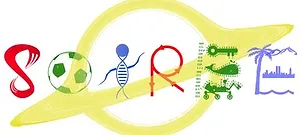
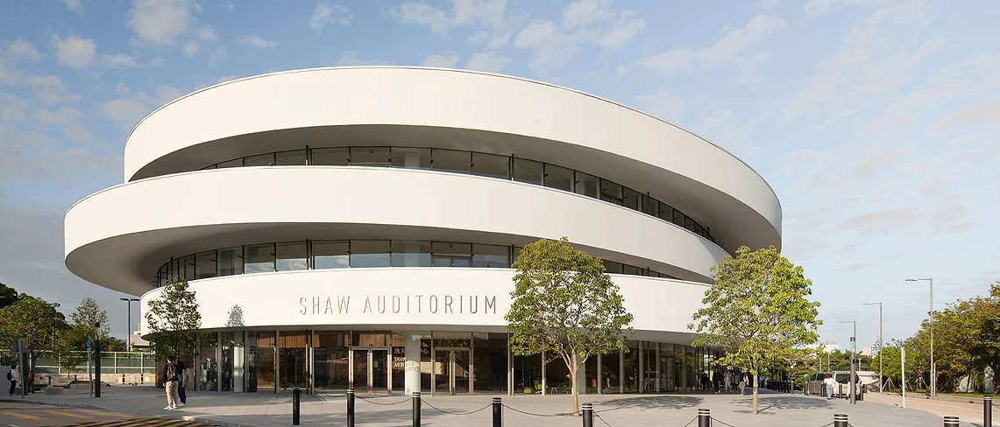

    

        
            <a href="../useful-information" style="text-decoration:underline;color:purple;font-size:24px;">Useful information</a>
        
        
            <a href="https://cso.ust.hk/locations/restaurants" style="text-decoration:underline;color:purple;font-size:24px;">Food Catering On Campus</a>
        
    

    

    

    

        <strong>
            Community Outreach
        
        </strong>
         
        
         
         
        
    

    

    

        <strong>
            Entrepreneurship
        
        </strong>
         
        
             
            <a href="https://hkust.edu.hk/entrepreneurship" style="font-size:20px;text-decoration:underline;color:blue;">More information</a>
        
    

    

    

        <strong>
            Shaw Auditorium
        
        </strong>
         
        
             
            <a href="https://shaw-auditorium.hkust.edu.hk/" style="font-size:20px;text-decoration:underline;color:blue;">More information</a>
        
    

    
    

    

        <strong>
            Tourism
        
        </strong>
         
        
             
            <a href="https://www.discoverhongkong.com/eng/explore/neighbourhoods/sai-kung.html" style="font-size:20px;text-decoration:underline;color:blue;">Discover Sai Kung</a> 
             
            <a href="https://geoexpat.com/articles/out-about/a-guide-to-clearwater-bay" style="font-size:20px;text-decoration:underline;color:blue;">Discover Clear Water Bay</a> 
        
    

