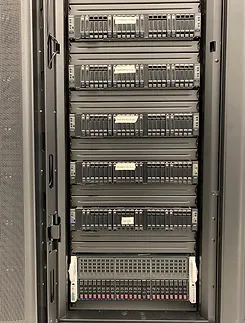
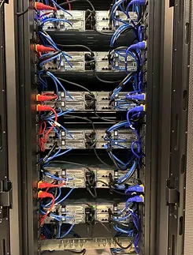

    

        <a href="../Lab/" style="font-size:24px;">Laboratory arrangement</a> 
    

    

    

        <a href="../Software/" style="font-size:24px;">Softwares</a>   
         Packages 
         Toolkits 
    

    

        <a href="../Computers/" style="font-size:24px;">CPU & GPU Computing Resources</a>   
        
        
        
    

    

        <a href="../Computers/" style="font-size:24px;">Complilations</a>   
        
    

