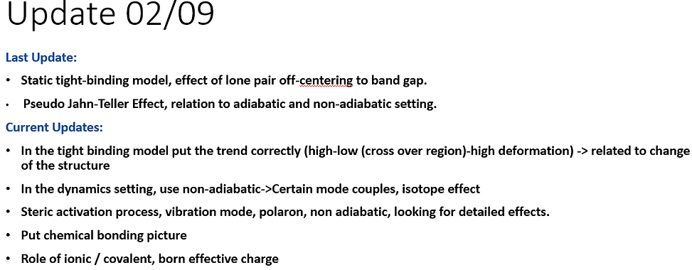
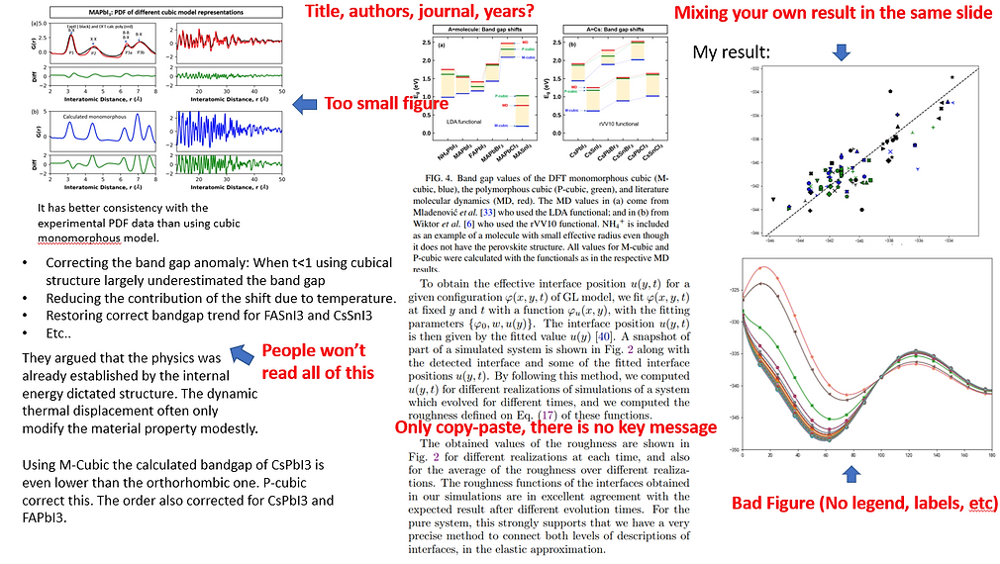

<h1 style="font-size:40px;color:blue;text-align:center;font-weight:bold">Tips for meeting discussion</h1>

<strong>1.Start with the summary of last meeting</strong>

Example of previous meeting summary slide

<strong>2.Show your best results, with several things in mind</strong>

<ul style="font-size:20px;">
    <li>Figure is the most important thing beside equations and words.</li>
    <li>In figures shown, always plot it beautifully with legends and caption.</li>
</ul>

A <strong>BAD</strong> example of meeting slides. Don't do this

<strong>3. Discussion of results</strong>

<ul style="font-size:20px;">
    <li>Why doing this？</li>
    <li>Is the result promising? Are there any problems?</li>
    <li>What is the indication of the result?</li>
</ul>

<strong>4. If you want to present about a paper you have read</strong>

<ul style="font-size:20px;">
    <li>Point out the key messages. Focus on the argument and how it is related to your current research instead of minor details.</li>
    <li>What is your understanding of the paper? Good point? Contents that are not fully explained?</li>
</ul>